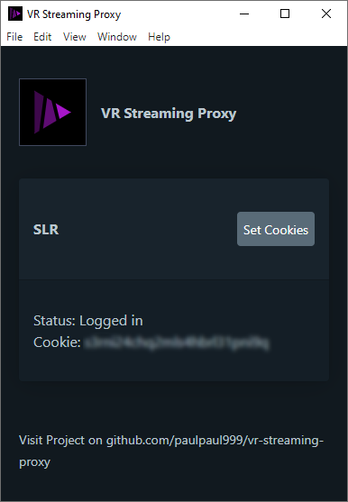

# vr-streaming-proxy

Proxy to enable true internet streaming for DLNA video players.



## Tutorial

## Install and run from source code

**Prerequisites:**
- [Node.js](https://nodejs.org/) 16.x
- npm or yarn


Download the source as [ZIP archive](https://github.com/paulpaul999/vr-streaming-proxy/archive/refs/heads/main.zip) **OR** clone it with git:

```
git clone https://github.com/paulpaul999/vr-streaming-proxy.git
```

Then change into the directory, install dependencies:

    cd vr-streaming-proxy
    npm install

Finally, run the server with:

    npm start
    
